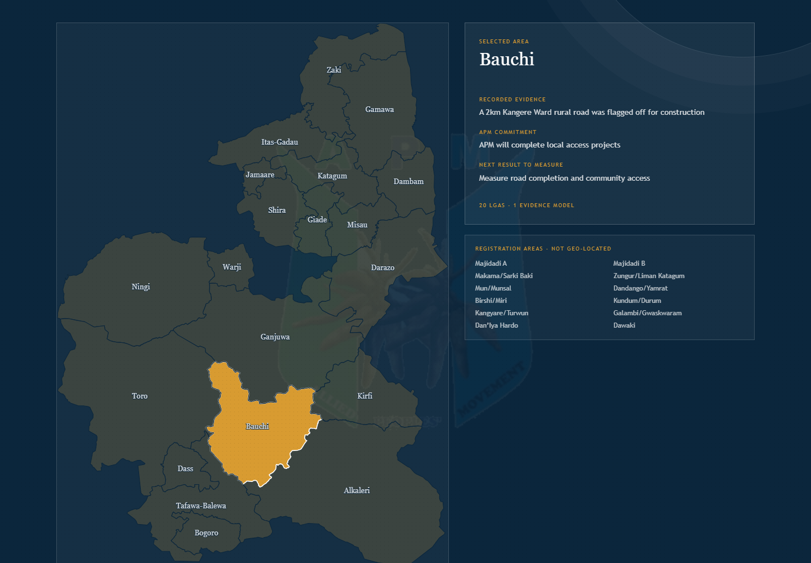
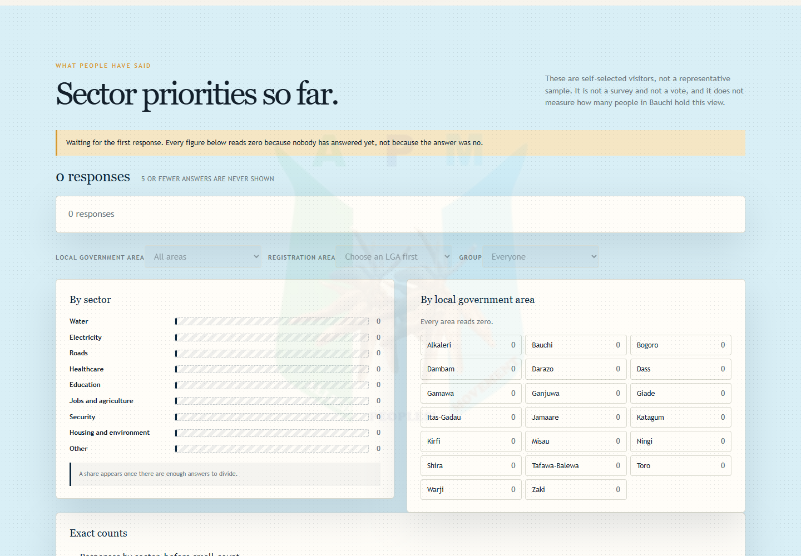
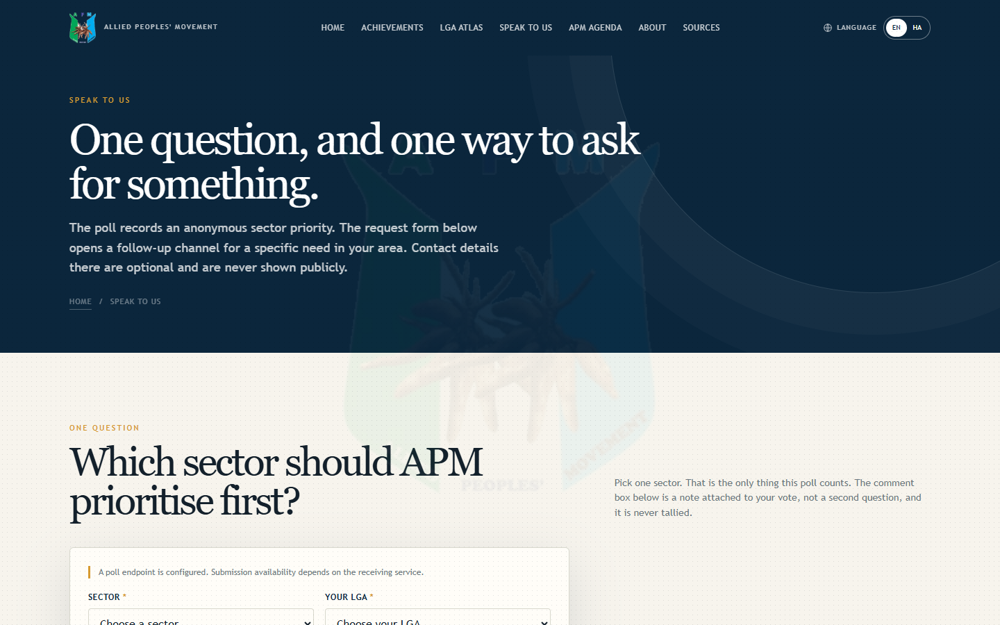
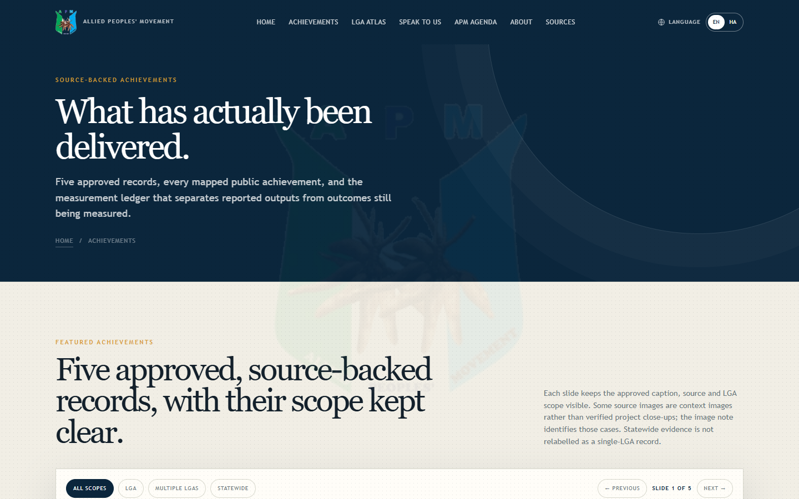

# APM Bauchi Progress & Delivery

[](https://batestguy.github.io/bauchi-voter-pulse/)

### ➡️ **[Open the live site →](https://batestguy.github.io/bauchi-voter-pulse/)**

A source-backed, bilingual campaign intelligence site for the 2027 Bauchi State
governorship race. Every figure on it traces to a registered source, and campaign
commitments are never presented as completed work.

The site connects one chain:

```text
Public need → Current achievement → APM promise → Next result
```

The earlier sentiment/risk dashboard is legacy history. It is still in the repository and
is **not** invoked by the Pages build and **not** a fallback for this site.

---

## Screenshots

Taken from the live URL on **2 October 2026** at 1440 px, plus two at 390 px. They are in
`docs/screenshots/` and are regenerated by re-running the same steps; nothing on the site
depends on them.

### Home — `index.html`


### LGA atlas with Bauchi selected — `atlas.html`

The map is the **only** area selector. Selecting a shape loads that area's evidence:
recorded evidence, the APM commitment, the next result to measure, and the area's
registration areas — the last labelled *not geo-located*, because the file carries no
coordinates and none are invented.



### Poll dashboard at zero — `poll.html`

**This is the honest empty state, not a demo.** Every control is live, every figure is an
explicit `0`, and the hatched tracks are what a *measured* zero must not look like. The
banner above the figures says why, and the disclosure to its right says these are
self-selected visitors, not a representative sample.



### Both public forms — `poll.html`

The opinion poll and the need-request form live on one page, each with its own Sheet and its
own endpoint.



### Achievements — `achievements.html`



### Agenda — `agenda.html`


### About — `about.html`


### Sources and method — `sources.html`


### Mobile — 390 px

The nav collapses to a no-JS `<details>` menu. Without it a phone cannot reach any
subpage, because the desktop nav is `display: none` below 1050 px.

| Home | Poll |
|---|---|
|  |  |

---

## The seven pages

All seven are generated by one renderer from `data/delivery/*.csv`. There is no CMS and no
runtime data source.

| Page | What it carries |
|---|---|
| `index.html` | Hero, the four-step story, sector filter, continuity framing, cards into every subpage |
| `achievements.html` | Featured carousel, all 25 achievement records, the measurement ledger |
| `atlas.html` | The 20-LGA map, the selected-area evidence panel, the not-geo-located registration-area list |
| `poll.html` | **Both public forms** — the opinion poll with its results dashboard, and the need-request form |
| `agenda.html` | The published campaign commitments |
| `about.html` | The candidate's record, his own words, and who built the site |
| `sources.html` | Source register, grading legend, build method |

The whole site is English/Hausa. The chosen language persists in the browser across
navigation and reload, and every bilingual string ships with its own text in both languages —
an element that owns children never carries the translation attributes, because `setLanguage`
rewrites `textContent` and would delete the subtree. That has emptied the map once.

## What is in the data

Counts below are derived from the committed CSVs, not written by hand.

| Thing | Count | Source file |
|---|---|---|
| Achievement records | 25 | `data/delivery/achievements.csv` |
| Featured achievements (carousel) | 5 | `data/delivery/featured_achievements.csv` |
| Tracked commitments | 8 | `data/delivery/promises.csv` |
| Published needs | 8 | `data/delivery/needs.csv` |
| Outcome indicators | 8 | `data/delivery/indicators.csv` |
| Bauchi LGAs | 20 | `data/delivery/lga_delivery.csv` |
| Registration areas (provisional INEC RAs) | 212 | `data/delivery/lga_wards.csv` |
| Registered sources | 28 | `data/delivery/source_register.csv` |
| Registered and approved assets | 12 | `data/delivery/asset_register.csv` |

**One of the 8 commitments is a clause, not a pillar.** The published campaign source contains
no standalone water pillar, so `promise-wash` is labelled
`Published commitment clause` / *Published clause of the Infrastructure Development
commitment* in its own row. It is presented as part of the infrastructure commitment, not as
a ninth thing the campaign published. All 8 rows carry distinct text, and
`validate_unique_promises()` fails the build if that ever stops being true.

**No new asset renders without a register row.** Every row in `asset_register.csv` needs a
matching SHA-256 on disk, a `usage_status` of `campaign approved`, and an `approved_at` date;
`validate_data()` re-hashes all of them on every build.

## Repository map

```text
src/dashboard/render.py     the single generator + validator for all seven pages
src/poll/                   poll contract, tally, validation, and build_snapshot.py
src/requests/               request-form validation and privacy-safe aggregation contracts
src/ingestion/              official-source discovery, archival, scraping, LGA boundary fetch
src/derived/lga_paths.py    stdlib simplification + projection into committed SVG path data
data/delivery/              sources, needs, achievements, promises, indicators, featured
                            achievements, LGA queue, registration areas, asset register
data/derived/lga_paths.json committed SVG geometry, so the weekly rebuild never calls ArcGIS
data/delivery/source_snapshots/  the cached boundary file the build requires
docs/                       the generated site (GitHub Pages serves this directory)
docs/screenshots/           documentation screenshots of the live site
docs/apps-script/           poll endpoint, GENERATED from Code.gs.template
docs/requests-script/       request endpoint, GENERATED from its own template
docs/*.md                   owner-facing setup guides and the Hausa review record
.github/workflows/          rebuild-pages, delivery-sources, budgets, scrape
assets/brand/               approved campaign assets
```

**Never edit a generated `Code.gs`.** Edit `Code.gs.template`, regenerate, `clasp push`. The
generator is the only thing that writes those two files, and each endpoint has a Node harness
that runs the **real** `doPost` with the Apps Script globals stubbed — the endpoint, not a
mock of it.

## Run it locally

```bash
python -m unittest discover -s tests -q     # 402 passed, 1 skipped
python src/dashboard/render.py              # writes all seven pages
python -m http.server 8766 --directory docs
```

Then open `http://127.0.0.1:8766/index.html`. Python 3.12+; dependencies in
`requirements.txt` are only needed by the ingestion pipeline and the legacy classifier — the
renderer itself is standard library.

The two endpoint harnesses also run standalone:

```bash
node docs/apps-script/test_endpoint.mjs      # 111/111
node docs/requests-script/test_endpoint.mjs  # 215/215
```

They are wired into the Python suite as well, so `unittest discover` runs them too. Run each
directly whenever you have touched its `Code.gs`.

`tests/test_browser_layout.py` is **skipped** unless Playwright is installed, because
Playwright is deliberately not a runtime dependency:

```bash
pip install playwright && python -m playwright install chromium
python -m unittest tests.test_browser_layout -v
```

It is the only thing that measures real horizontal overflow at 375 px and confirms the
no-JS menu opens. `tests/test_site_structure.py` carries static guards for the same
regressions so they cannot return unnoticed in CI.

## How it gets published

**Automatic, weekly.** `rebuild-pages.yml` runs on Mondays at 06:00 UTC (and on demand via
`workflow_dispatch`), and it: checks every campaign asset is approved, runs the renderer,
**fails if any of the seven pages is missing**, commits `docs/*.html`, and pushes. GitHub
Pages serves `docs/`.

That cron had never completed a successful run until 29 September 2026. Two release traps
are now closed and test-guarded, and both had made it fail on its first scheduled run: the
asset gate parses `asset_register.csv` with `csv.DictReader` rather than `awk -F,`, which
split inside quoted commas and read an approved asset as unapproved; and the snapshot
manifest is verified against the bytes git actually committed rather than the working copy.

**Manual, and deliberately so: poll results.** The dashboard reads a committed
`data/delivery/poll_snapshot.json`. Nothing reads the Sheet automatically. When there are
responses worth publishing:

```bash
# File > Download > Comma-separated values on the Responses tab
python src/poll/build_snapshot.py ~/Downloads/Sheet1.csv
python src/dashboard/render.py
git add data/delivery/poll_snapshot.json docs/*.html
```

A workflow that read the Sheet would need a Google service-account key committed as a
repository secret. On a public repository that is a real increase in attack surface, and
exporting the tab keeps every credential out of git entirely.

**An empty export writes nothing and exits non-zero.** The page's own empty state is the
honest answer; a committed snapshot of zeroes would replace it with a chart of nothing. A
test enforces that no placeholder tally exists anywhere in the repository.

## The two live forms

Both are deployed Apps Script web apps bound to their own Sheet. The `/exec` URLs are in the
served HTML and therefore public by construction — **the protection is the validation
contract, not the secrecy of the string.**

```text
POLL_ENDPOINT     -> APM poll responses    (Responses, Comments, Audit, Retention tabs)
REQUEST_ENDPOINT  -> APM requests          (Requests, Audit tabs)
```

Both are verified by submitting from a real browser, not only by server-side probe. Neither
inspects `e.contentType`: both read `e.postData.contents`, which is why the forms send
`text/plain` and avoid the CORS preflight Apps Script cannot satisfy. **Never send
`Content-Type: application/json` from a browser to an Apps Script `/exec` endpoint** — it
fails with a bare `Failed to fetch`, no console error, and a user who is told their vote was
not sent.

### The poll's privacy contract

Enforced in code and test-guarded, not merely intended:

- **No direct identity.** No name, phone, email, address, NIN, BVN, voter ID or exact age.
  The exact-age aliases are refused *by name*, because the form collects age **bands** and
  those are the keys someone would reach for to defeat that.
- **Area and demographics ARE collected** — required LGA, optional registration area,
  optional age group, optional gender. This reverses an earlier "no PII at all" rule, and it
  is a deliberate owner decision to allow an area breakdown.
- **Small-cell suppression is mandatory, with a hard floor of 2.** Any non-zero cell below the
  threshold is published as `null` and renders as a dash or a hatched bar. A published cell of
  1 or 2 from a dataset that records an LGA and a registration area is a published cell of
  identifiable people. **A cell of 0 is published**, because "nobody chose this" identifies
  nobody — and it is drawn differently from a withheld cell for the same reason.
- **A share is printed only when it is exact.** If any cell in scope was suppressed the true
  denominator is larger than the visible sum, so the count shows and the share becomes a dash.
- **A registration area is never crossed with a demographic.** Ward × gender and ward × age
  are refused as data, not just in prose; a test walks the key path of every leaf in the tally
  *and* in the published snapshot.
- **Q2 never moves a number.** The comment is validated, length-capped and stored on its own
  tab — **without** the `response_id` that would let anyone re-join it to the row carrying the
  area and the demographics. It is never counted, bucketed or published.
- **Retention is a ceiling, not a floor.** Default 180 days, `MAX_COMMENT_RETENTION_DAYS = 365`,
  `0` and negatives refused. A daily `purgeExpiredComments` trigger clears expired text and
  keeps sector, LGA and timestamp. An unparseable timestamp is **deleted, not kept**.
  Blanking a cell does not remove it from Sheet version history — pruning that is an owner
  action no code can reach.

Expect the ward breakdown to be mostly empty. In a 320-response fixture all 20 LGAs were
publishable but *no* LGA had a usable registration-area breakdown. That is the data being
honest, and the page says "too few to show" rather than inventing a figure.

### The request form's privacy contract

The request form stores a name, an optional email address and a street address. **That is
the point of the form**, so the poll's identity rules are deliberately *not* applied to it.

- **A phone number is refused, not dropped.** It left the form, the allowed-field list and
  the length limits together. Email is the only correspondence channel.
- **The `Audit` tab is three columns wide** — timestamp, outcome, stable rejection code — and
  cannot hold a fourth. A rejected request carries all five private fields and must leave only
  the code behind.
- **The record `validate_` returns is what gets persisted**, never the raw payload. That bug
  once stored `bAUcHi` as an LGA name.
- **The endpoint refuses to run without a complete ward map.** The Python contract tolerates a
  missing map and marks the row `ward_map_missing`; for an endpoint that warning is invisible,
  so an empty map is a loud failure instead.
- **There is no rate limiting and no automatic purge**, and both are owner decisions rather
  than oversights. See *Owner decisions* below.

## Evidence rules

- Public sources only; robots.txt and rate limits remain enforced.
- Every achievement and promise carries a source record.
- Campaign promises are not displayed as completed achievements.
- Statewide records are not forced into an LGA without evidence.
- Missing data remains unknown and is not estimated.
- The current administration is described as progress that APM can build on and complete.
- The request form never requests an official voter ID; the generated tracking reference is
  not a voter ID. It is sequential and never derived from the response content — a content
  hash is a stable fingerprint anyone could confirm by guessing someone's answer.
- The RA selector uses provisional INEC electoral registration areas and does not claim a
  current administrative-ward schedule.
- Map boundaries are GRID3 operational boundaries shown as **indicative and not gazetted**,
  with the CC BY credit and change indication on the page. Registration areas are listed as
  **not geo-located** and are never drawn.
- Source titles are citations and stay in their original language, untranslated. Our own prose
  must translate.
- The page is public-source campaign intelligence, **not private polling**, and says so.

## Known disclosures

**Hausa provenance.** 129 Hausa strings added in September 2026 are **AI-drafted** — 53 from
S1/S2, 6 from the atlas, 4 in the footer contributor credit, and 66 in the poll. Disclose that
wherever they ship. The owner reviewed and accepted the S1–S4 set as written on 29 September
2026; an independent AI pass over the poll strings on 30 September 2026 found and corrected
**20 defects**, including a re-identification warning that had lost its negation, a privacy
disclosure that had dropped the word "exact", and the map's licensing caveat that said
"colours" where it meant "boundaries". **That AI pass did not close the gate on its own** — an
AI reviewing AI-drafted Hausa only produces candidates — and the owner reports the
native-speaker review complete on 2 October 2026. **The disclosure stays**, because the
strings are machine-drafted and machine-corrected, then human-reviewed: that is a different
claim from "written by a speaker". Every string, its correction and the reviewer's open list
are in [`docs/HAUSA_REVIEW.md`](docs/HAUSA_REVIEW.md).

**Map licensing.** The boundaries are GRID3/eHealth Africa operational LGA boundaries,
**CC BY 4.0**, cached once at
`data/delivery/source_snapshots/grid3-lga-boundaries-bauchi.geojson`. They descend from
polio-vaccination microplanning data and are **not gazetted**; the page says so, and the
"simplified for display" change indication ships under the map. The sibling GRID3 **Wards**
layers are CC BY-SA and would force ShareAlike onto the whole site — never use them.

**Boundary fetch robots exemption.** `services3.arcgis.com` serves **403 for `robots.txt`
under every user agent**, so that host carries a narrowly-scoped, explicitly justified
exemption in `src/ingestion/common.py::ROBOTS_UNREACHABLE_HOSTS`. The registrable domain
serves a retrievable permissive robots.txt and the layer is openly CC BY 4.0. The default
conservative skip is unchanged for every other host. **The owner ratified this on
29 September 2026.**

**Asset rights.** `apm-emblem.png` is a derived crop of the already-approved
`apm-logo.png` with no new rights cleared; its `approval_note` still needs owner ratification,
and it is the one reason the watermark is worth knowing about — it makes the emblem far more
prominent than a header mark would. `abdulkadir-ahmad-hammayo.png` is a derived square crop
of a campaign-supplied portrait of the named contributor, registered with owner approval on
29 September 2026. **The footer credit names a real person**, so nothing around it may be
invented — no placeholder, no amount, no third-party name — and tests fail the build if any
appears.

## Owner decisions on record

Two decisions were open and are now closed. Both are recorded with their costs rather than as
ticked boxes, because a decision logged without its cost reads as an omission.

**Request-Sheet retention — decided 2 October 2026: nothing is deleted.** No automatic purge,
no deletion period. The reasoning: a retained request is staff workflow data, and expiring it
automatically would delete needs nobody has actioned. Two costs are permanent. **Blanking a
cell does not remove it from Sheet version history**, so any deletion is still owner-side. And
the tab holds a supporter's name and street address indefinitely, so exposure grows every
day; the mitigations are staff access control and a manual pruning rhythm, and **no code in
this repository can enforce or audit either one.** Do not describe this data as retained
"safely" or "by design" without saying who can read it and that nothing deletes it.

**Poll snapshot publishing — open, and blocked on data rather than on work.** As of
2 October 2026 the `Responses` tab holds its nine headers and **zero data rows**; the receipts
recorded during deployment were verification rows, deleted on 1 October.
`build_snapshot.py` was run against that real export and refused to write, which is the
correct outcome. The live page renders its honest empty state in the meantime. **Do not treat
this as a task to force through by committing zeroes.**

**Still open, in the owner's gift:** independent image rights clearance for the
achievement photography, and whether to narrow the `wash` sector label from "Water and
climate resilience" — the published campaign source contains zero climate content.

## Testing

```text
python -m unittest discover -s tests -q     402 passed, 1 skipped (Playwright)
node docs/apps-script/test_endpoint.mjs      111/111 checks
node docs/requests-script/test_endpoint.mjs  215/215 checks
```

The suite is deliberately unusual for a static site: most of it guards defects that **no
visual check can see** — a Hausa string pasted into an English column, a bilingual element
with no text of its own, a translation attribute on an element that owns children, an
unregistered asset, a duplicate `const` that would silently disable every script on a page, a
nav link pointing at a page that was never generated, a suppression floor lowered to 1, a
forbidden `ward × gender` crossing, an expired comment that survived the purge, a human review
that was read by nothing.

Two classes of bug are worth naming, because they recur and both were real here:

- **A checksum validated only against the working copy has never been tested against what a
  consumer receives.** On Windows the working copy differs from the committed blob, so the
  failure is invisible locally and fatal on the Linux runner. A test checks out `main` into a
  temp directory and renders there.
- **Something true of the data disagreed with something written beside it, and nothing
  compared the two.** "Five commitments" over eight rows; "five pages, one record" beside a nav
  of seven; a Sheet column named `received_at` against an aggregator reading `created_at`, which
  tallied **zero from twelve good rows** and printed `counted 0` with no error. In every case
  the fix was to derive the statement from the data and add a test that compares the two.

## Where to look next

| Document | What it answers |
|---|---|
| [`HANDOFF.md`](HANDOFF.md) | The operational starting point: current state, runbook, deployment traps, what is preserved locally and must not be touched |
| [`AGENTS.md`](AGENTS.md) | The rules, and the reasoning behind them. Read before changing anything |
| [`docs/POLL_SETUP.md`](docs/POLL_SETUP.md) | Poll Sheet columns, endpoint rules, CORS, retention |
| [`docs/GOOGLE_SHEETS_SETUP.md`](docs/GOOGLE_SHEETS_SETUP.md) | The request form's private-data setup |
| [`docs/HAUSA_REVIEW.md`](docs/HAUSA_REVIEW.md) | Every Hausa string, its correction, and why it was provable |
| [`SITE_EXPANSION_PLAN.md`](SITE_EXPANSION_PLAN.md) | Governing plan for the remaining phases |
| [`IMPLEMENTATION_PLAN.md`](IMPLEMENTATION_PLAN.md) | The original contract: data model, evidence hierarchy, acceptance criteria |

Preserved local work that is **not** committed and must not be staged, reset or cleaned:
`.evals/2026-W39.md` and `.evals/2026-W39_sample100_filled.csv` (the finished evaluation and
the filled sample), `data/human_review/filled/` (the completed, signed human reviews), and
`.playwright-mcp/` (local browser artefacts). Never `git add .` over them.

`Code.gs` is committed on purpose. It holds no credential, no Sheet ID and no deployment ID;
its only data is the public registration-area map, already in `lga_wards.csv` and on the form.
`.clasp.json` is gitignored for both endpoint folders.

---

**[← Back to the live site: batestguy.github.io/bauchi-voter-pulse](https://batestguy.github.io/bauchi-voter-pulse/)**